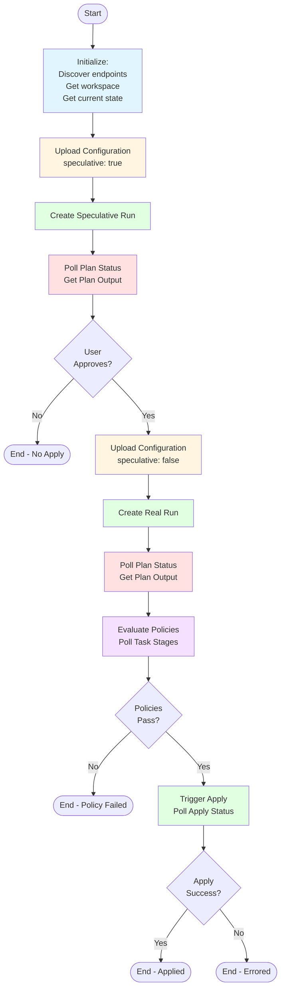
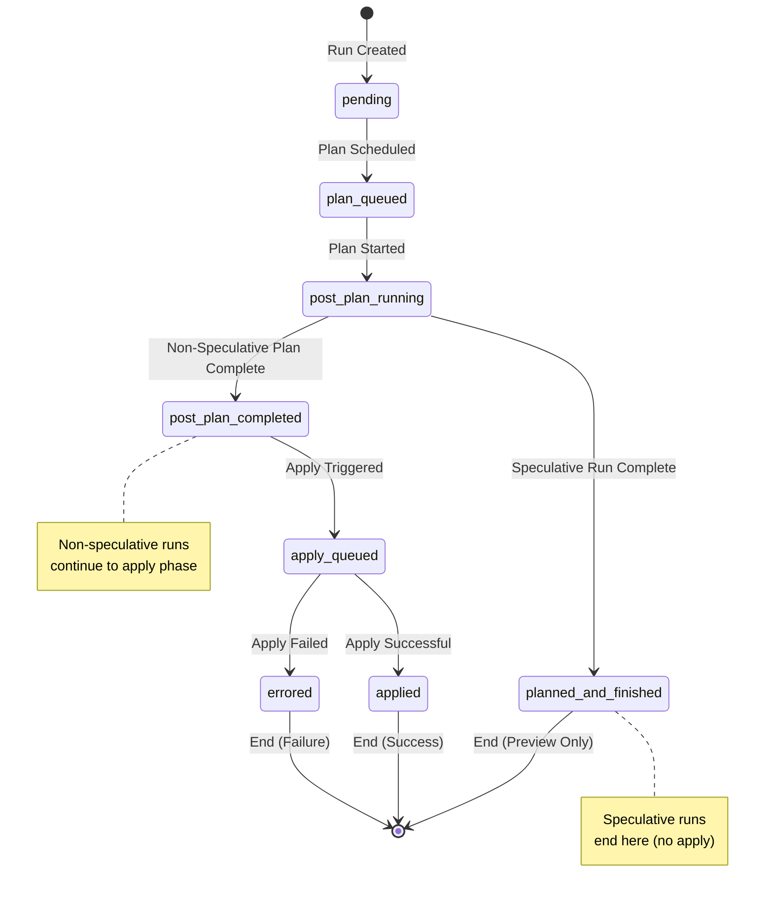
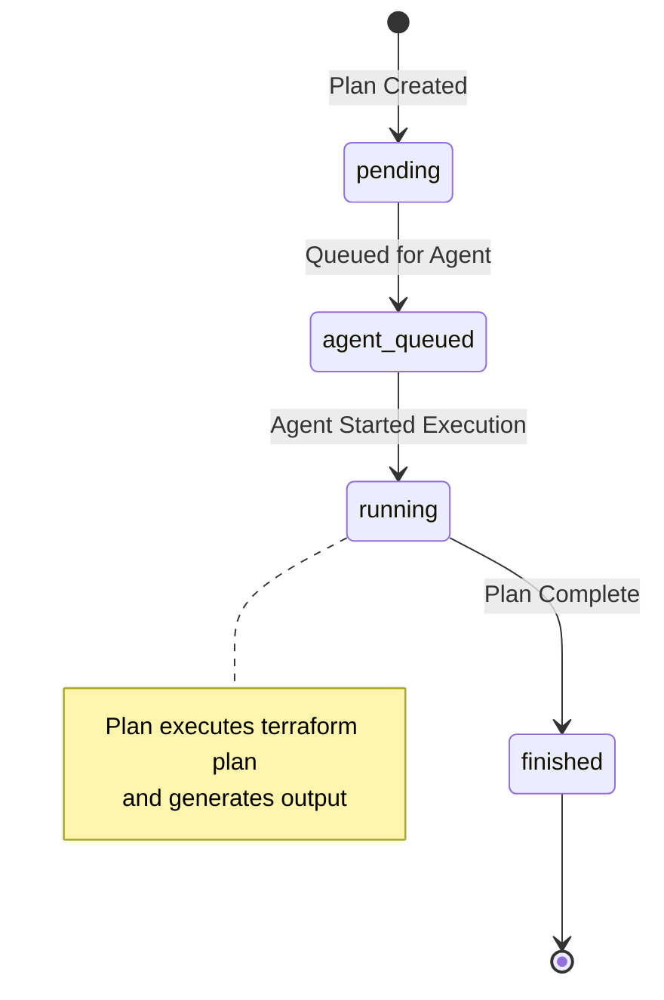
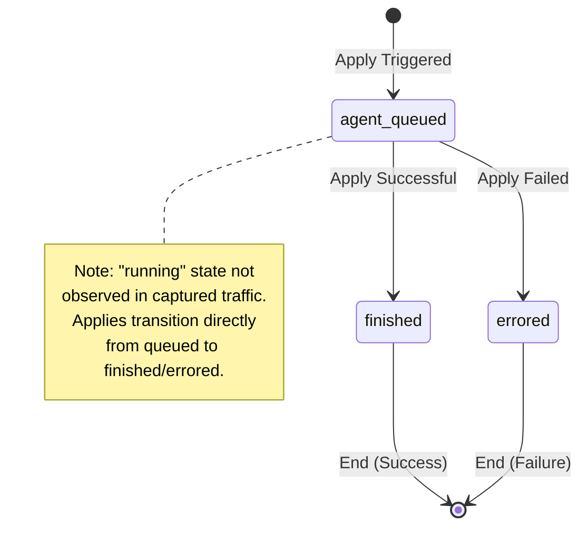
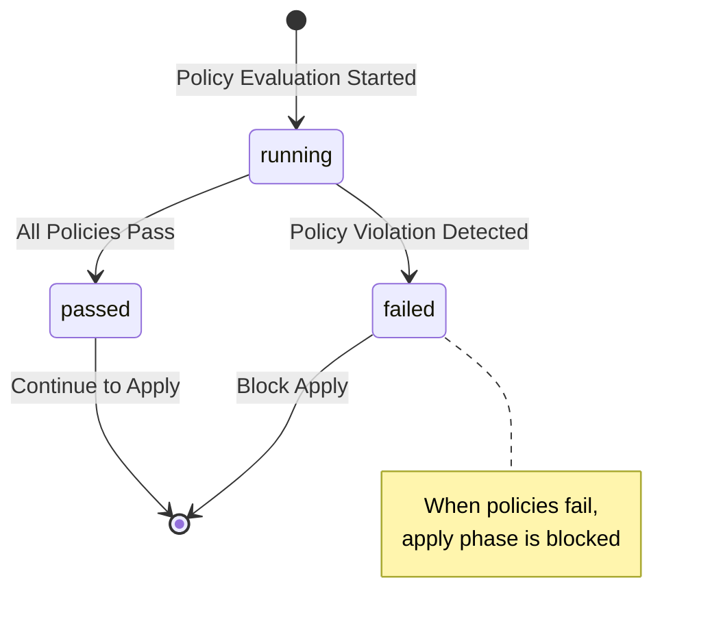
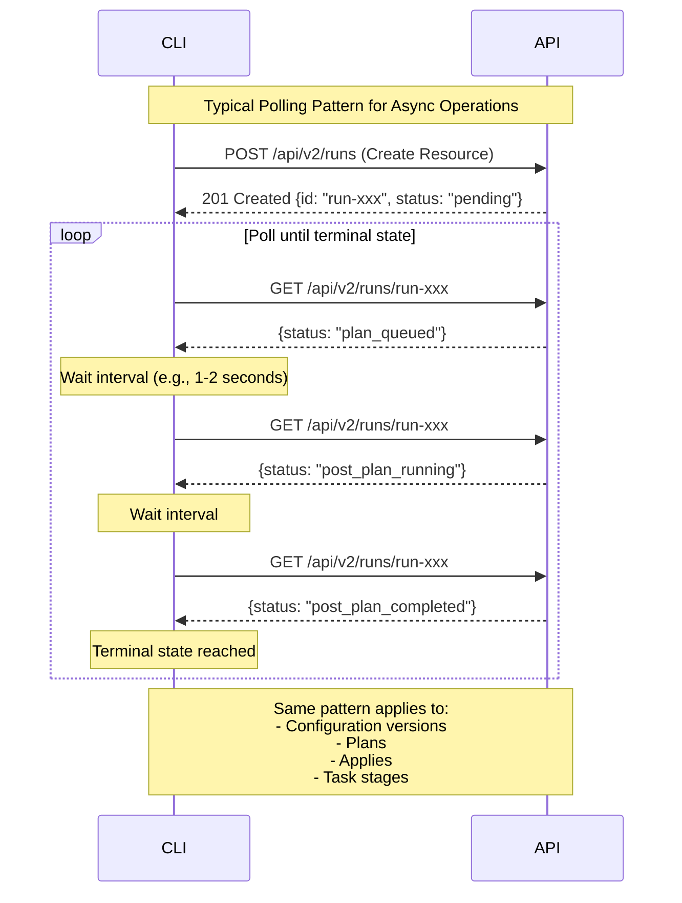
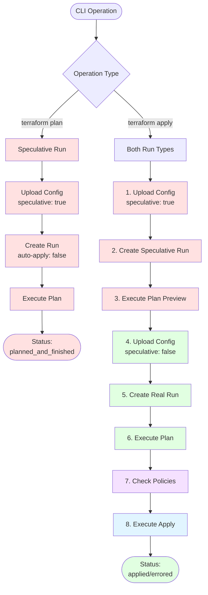
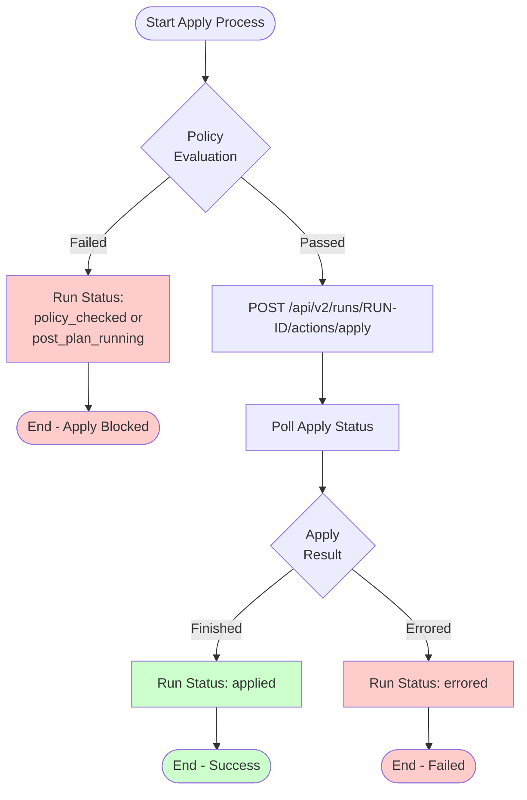

# Terraform Cloud API Workflow Diagrams

This document provides visual representations of the Terraform Cloud API flow using Mermaid diagrams.

> **Source Code References**: For detailed mappings of each API endpoint to Terraform CLI source code, see [API_ENDPOINTS_SOURCE_CODE_MAPPING.md](API_ENDPOINTS_SOURCE_CODE_MAPPING.md)

## 1. Overall Workflow Sequence

```mermaid
sequenceDiagram
    participant CLI as Terraform CLI
    participant API as Terraform Cloud API
    participant Storage as External Storage

    %% Initialization Phase
    rect rgb(240, 248, 255)
        Note over CLI,API: Initialization Phase
        CLI->>API: GET /.well-known/terraform.json
        API-->>CLI: Service endpoints
        CLI->>API: GET /api/v2/ping
        API-->>CLI: 204 No Content
        CLI->>API: GET /api/v2/organizations/{org}/entitlement-set
        API-->>CLI: Organization permissions
        CLI->>API: GET /api/v2/organizations/{org}/workspaces/{workspace}
        API-->>CLI: Workspace details
        CLI->>API: GET /api/v2/workspaces/{ws-id}/current-state-version
        API-->>CLI: Current state version
        CLI->>API: GET /api/state-versions/{sv-id}/hosted_state
        API-->>CLI: 302 Redirect
        CLI->>Storage: GET state file
        Storage-->>CLI: State file content
    end

    %% Configuration Upload - Speculative
    rect rgb(255, 250, 240)
        Note over CLI,API: Configuration Upload (Speculative)
        CLI->>API: POST /api/v2/workspaces/{ws-id}/configuration-versions<br/>{speculative: true}
        API-->>CLI: Configuration version (cv-id, status: pending)
        CLI->>API: PUT {upload-url} (tarball)
        API-->>CLI: 200 OK
        loop Poll until uploaded
            CLI->>API: GET /api/v2/configuration-versions/{cv-id}
            API-->>CLI: status: uploaded
        end
    end

    %% Run Creation - Speculative
    rect rgb(240, 255, 240)
        Note over CLI,API: Create Speculative Run
        CLI->>API: POST /api/v2/runs<br/>{cv-id, auto-apply: false}
        API-->>CLI: Run created (run-id, status: pending)
    end

    %% Planning Phase - Speculative
    rect rgb(255, 245, 245)
        Note over CLI,API: Planning Phase (Speculative)
        loop Poll run status
            CLI->>API: GET /api/v2/runs/{run-id}
            API-->>CLI: status: plan_queued → post_plan_running
        end
        loop Poll plan status
            CLI->>API: GET /api/v2/plans/{plan-id}
            API-->>CLI: status: agent_queued → running → finished
        end
        CLI->>API: GET /api/v2/plans/{plan-id}/json-output-redacted
        API-->>CLI: 307 Redirect to plan JSON
        CLI->>API: GET /api/v2/runs/{run-id}
        API-->>CLI: status: planned_and_finished
    end

    %% Configuration Upload - Non-Speculative
    rect rgb(255, 250, 240)
        Note over CLI,API: Configuration Upload (Non-Speculative)
        CLI->>API: POST /api/v2/workspaces/{ws-id}/configuration-versions<br/>{speculative: false}
        API-->>CLI: Configuration version (cv-id)
        CLI->>API: PUT {upload-url} (tarball)
        API-->>CLI: 200 OK
        loop Poll until uploaded
            CLI->>API: GET /api/v2/configuration-versions/{cv-id}
            API-->>CLI: status: uploaded
        end
    end

    %% Run Creation - Non-Speculative
    rect rgb(240, 255, 240)
        Note over CLI,API: Create Real Run
        CLI->>API: POST /api/v2/runs<br/>{cv-id, auto-apply: false}
        API-->>CLI: Run created (run-id)
    end

    %% Planning Phase - Non-Speculative
    rect rgb(255, 245, 245)
        Note over CLI,API: Planning Phase (Non-Speculative)
        loop Poll run status
            CLI->>API: GET /api/v2/runs/{run-id}
            API-->>CLI: status: plan_queued → post_plan_running
        end
        loop Poll plan status
            CLI->>API: GET /api/v2/plans/{plan-id}
            API-->>CLI: status: agent_queued → running → finished
        end
        CLI->>API: GET /api/v2/runs/{run-id}
        API-->>CLI: status: post_plan_completed
    end

    %% Policy Evaluation
    rect rgb(250, 240, 255)
        Note over CLI,API: Policy Evaluation Phase
        loop Poll task stage
            CLI->>API: GET /api/v2/task-stages/{ts-id}
            API-->>CLI: status: running → passed/failed
        end
        CLI->>API: GET /api/v2/policy-evaluations/{pe-id}/policy-set-outcomes
        API-->>CLI: Policy results
    end

    %% Apply Phase
    alt Policy Passed
        rect rgb(245, 255, 245)
            Note over CLI,API: Apply Phase
            CLI->>API: POST /api/v2/runs/{run-id}/actions/apply
            API-->>CLI: 202 Accepted
            CLI->>API: GET /api/v2/runs/{run-id}
            API-->>CLI: status: apply_queued
            loop Poll apply status
                CLI->>API: GET /api/v2/applies/{apply-id}
                API-->>CLI: status: agent_queued → finished/errored
            end
            CLI->>API: GET /api/v2/runs/{run-id}
            API-->>CLI: status: applied/errored
        end
    else Policy Failed
        Note over CLI,API: Apply phase skipped
    end
```

## 2. High-Level Workflow State Machine

## 3. Run Status State Machine

## 4. Plan Status State Machine

## 5. Apply Status State Machine

## 6. Task Stage (Policy) Status State Machine

## 7. Key API Endpoints by Phase

```mermaid
flowchart LR
    subgraph Init[Initialization]
        direction TB
        I1[GET /.well-known/terraform.json]
        I2[GET /api/v2/ping]
        I3[GET /api/v2/organizations/ORG/entitlement-set]
        I4[GET /api/v2/organizations/ORG/workspaces/WS]
        I5[GET /api/v2/workspaces/WS-ID/current-state-version]
    end

    subgraph Config[Configuration]
        direction TB
        C1[POST /api/v2/workspaces/WS-ID/configuration-versions]
        C2[GET /api/v2/configuration-versions/CV-ID]
    end

    subgraph Runs[Runs]
        direction TB
        R1[POST /api/v2/runs]
        R2[GET /api/v2/runs/RUN-ID]
        R3[GET /api/v2/runs/RUN-ID/run-events]
        R4[POST /api/v2/runs/RUN-ID/actions/apply]
    end

    subgraph Plans[Plans]
        direction TB
        P1[GET /api/v2/plans/PLAN-ID]
        P2[GET /api/v2/plans/PLAN-ID/json-output-redacted]
    end

    subgraph Applies[Applies]
        direction TB
        A1[GET /api/v2/applies/APPLY-ID]
    end

    subgraph Policy[Policy]
        direction TB
        POL1[GET /api/v2/task-stages/TS-ID]
        POL2[GET /api/v2/policy-evaluations/PE-ID/policy-set-outcomes]
    end

    Init --> Config
    Config --> Runs
    Runs --> Plans
    Plans --> Policy
    Policy --> Applies

    style Init fill:#e1f5ff
    style Config fill:#fff5e1
    style Runs fill:#e1ffe1
    style Plans fill:#ffe1e1
    style Applies fill:#f5e1ff
    style Policy fill:#f0e1ff
```

## 8. Polling Pattern Example

## 9. Speculative vs Non-Speculative Runs

## 10. Error Handling Paths

---

## 11. API Calls with Source Code References

The following table shows each API operation with links to the Terraform CLI source code:

### Initialization Phase

| API Call | HTTP Method | go-tfe Method | Source File | Function |
|----------|-------------|---------------|-------------|----------|
| `/.well-known/terraform.json` | GET | Client Init | [go-tfe library](https://github.com/hashicorp/go-tfe) | Service discovery |
| `/api/v2/ping` | GET | Client Init | [go-tfe library](https://github.com/hashicorp/go-tfe) | Health check |
| `/api/v2/organizations/{org}/entitlement-set` | GET | `Organizations.ReadEntitlements()` | [backend.go](https://github.com/hashicorp/terraform/blob/main/internal/cloud/backend.go) | Configure() |
| `/api/v2/organizations/{org}/workspaces/{ws}` | GET | `Workspaces.Read()` | [backend.go](https://github.com/hashicorp/terraform/blob/main/internal/cloud/backend.go) | StateMgr() |
| `/api/v2/workspaces/{id}/current-state-version` | GET | `StateVersions.ReadCurrent()` | [state.go](https://github.com/hashicorp/terraform/blob/main/internal/cloud/state.go) | getStatePayload() |
| `/api/state-versions/{id}/hosted_state` | GET | `StateVersions.Download()` | [state.go](https://github.com/hashicorp/terraform/blob/main/internal/cloud/state.go) | getStatePayload() |

### Configuration Upload Phase

| API Call | HTTP Method | go-tfe Method | Source File | Function |
|----------|-------------|---------------|-------------|----------|
| `/api/v2/workspaces/{id}/configuration-versions` | POST | `ConfigurationVersions.Create()` | [backend_common.go](https://github.com/hashicorp/terraform/blob/main/internal/cloud/backend_common.go#L800) | uploadConfigurationVersion() |
| `{upload-url}` | PUT | `ConfigurationVersions.Upload()` | [backend_common.go](https://github.com/hashicorp/terraform/blob/main/internal/cloud/backend_common.go#L850) | uploadConfigurationVersion() |
| `/api/v2/configuration-versions/{id}` | GET | `ConfigurationVersions.Read()` | [backend_common.go](https://github.com/hashicorp/terraform/blob/main/internal/cloud/backend_common.go#L865) | uploadConfigurationVersion() |

### Run Creation & Planning Phase

| API Call | HTTP Method | go-tfe Method | Source File | Function |
|----------|-------------|---------------|-------------|----------|
| `/api/v2/runs` | POST | `Runs.Create()` | [backend_plan.go](https://github.com/hashicorp/terraform/blob/main/internal/cloud/backend_plan.go#L190) | plan() |
| `/api/v2/runs/{id}` | GET | `Runs.Read()` | [backend_plan.go](https://github.com/hashicorp/terraform/blob/main/internal/cloud/backend_plan.go#L216) | plan() |
| `/api/v2/runs/{id}` (with includes) | GET | `Runs.ReadWithOptions()` | [backend_plan.go](https://github.com/hashicorp/terraform/blob/main/internal/cloud/backend_plan.go#L425) | renderPlanLogs() |
| `/api/v2/plans/{id}/logs` | GET | `Plans.Logs()` | [backend_plan.go](https://github.com/hashicorp/terraform/blob/main/internal/cloud/backend_plan.go#L385) | renderPlanLogs() |
| `/api/v2/plans/{id}/json-output-redacted` | GET | Custom API call | [backend_common.go](https://github.com/hashicorp/terraform/blob/main/internal/cloud/backend_common.go#L950) | readRedactedPlan() |

### Policy Evaluation Phase

| API Call | HTTP Method | go-tfe Method | Source File | Function |
|----------|-------------|---------------|-------------|----------|
| `/api/v2/runs/{id}` (include task-stages) | GET | `Runs.ReadWithOptions()` | [backend_taskStages.go](https://github.com/hashicorp/terraform/blob/main/internal/cloud/backend_taskStages.go) | runTaskStages() |
| `/api/v2/task-stages/{id}` | GET | `TaskStages.Read()` | [backend_taskStages.go](https://github.com/hashicorp/terraform/blob/main/internal/cloud/backend_taskStages.go) | runTaskStage() |
| `/api/v2/task-stages/{id}/actions/override` | POST | `TaskStages.Override()` | [backend_taskStages.go](https://github.com/hashicorp/terraform/blob/main/internal/cloud/backend_taskStages.go) | processStageOverrides() |

### Apply Phase

| API Call | HTTP Method | go-tfe Method | Source File | Function |
|----------|-------------|---------------|-------------|----------|
| `/api/v2/runs/{id}/actions/apply` | POST | `Runs.Apply()` | [backend_apply.go](https://github.com/hashicorp/terraform/blob/main/internal/cloud/backend_apply.go#L154) | opApply() |
| `/api/v2/runs/{id}` | GET | `Runs.Read()` | [backend_apply.go](https://github.com/hashicorp/terraform/blob/main/internal/cloud/backend_apply.go#L99) | opApply() |
| `/api/v2/applies/{id}/logs` | GET | `Applies.Logs()` | [backend_apply.go](https://github.com/hashicorp/terraform/blob/main/internal/cloud/backend_apply.go#L180) | renderApplyLogs() |

### Supporting Operations (Called During Workflow)

| API Call | HTTP Method | go-tfe Method | Source File | Function |
|----------|-------------|---------------|-------------|----------|
| `/api/v2/workspaces/{id}/runs` | GET | `Runs.List()` | [backend_common.go](https://github.com/hashicorp/terraform/blob/main/internal/cloud/backend_common.go#L120) | waitForRun() |
| `/api/v2/organizations/{org}/run-queue` | GET | `Organizations.ReadRunQueue()` | [backend_common.go](https://github.com/hashicorp/terraform/blob/main/internal/cloud/backend_common.go#L145) | waitForRun() |
| `/api/v2/organizations/{org}/capacity` | GET | `Organizations.ReadCapacity()` | [backend_common.go](https://github.com/hashicorp/terraform/blob/main/internal/cloud/backend_common.go#L165) | waitForRun() |
| `/api/v2/cost-estimates/{id}` | GET | `CostEstimates.Read()` | [backend_common.go](https://github.com/hashicorp/terraform/blob/main/internal/cloud/backend_common.go#L240) | costEstimate() |
| `/api/v2/runs/{id}/actions/discard` | POST | `Runs.Discard()` | [backend_common.go](https://github.com/hashicorp/terraform/blob/main/internal/cloud/backend_common.go#L730) | confirm() |
| `/api/v2/runs/{id}/actions/cancel` | POST | `Runs.Cancel()` | [backend.go](https://github.com/hashicorp/terraform/blob/main/internal/cloud/backend.go) | cancel() |

---

## Legend

- **Blue sections**: Initialization and discovery
- **Orange sections**: Configuration upload
- **Green sections**: Run and apply operations
- **Red sections**: Planning operations
- **Purple sections**: Policy evaluation
- **Light colors in flowcharts**: Different operation types

## Notes

1. All diagrams are based on actual HTTP traffic captured in .har files
2. Status transitions reflect observed behavior in production API
3. Polling patterns are simplified but represent the actual polling behavior
4. Multiple workspaces may be processed in parallel (not shown for clarity)
5. **Source code links** point to the Terraform CLI codebase where each API call originates
6. The actual HTTP requests are made by the [go-tfe library](https://github.com/hashicorp/go-tfe), which implements the JSON:API protocol
